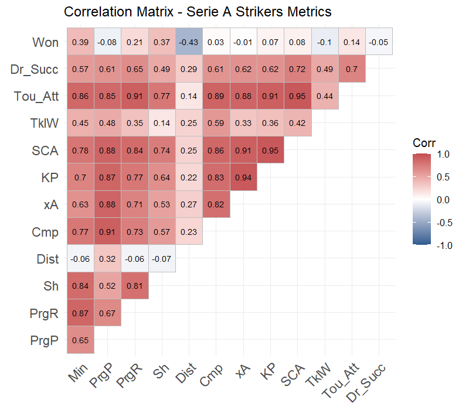
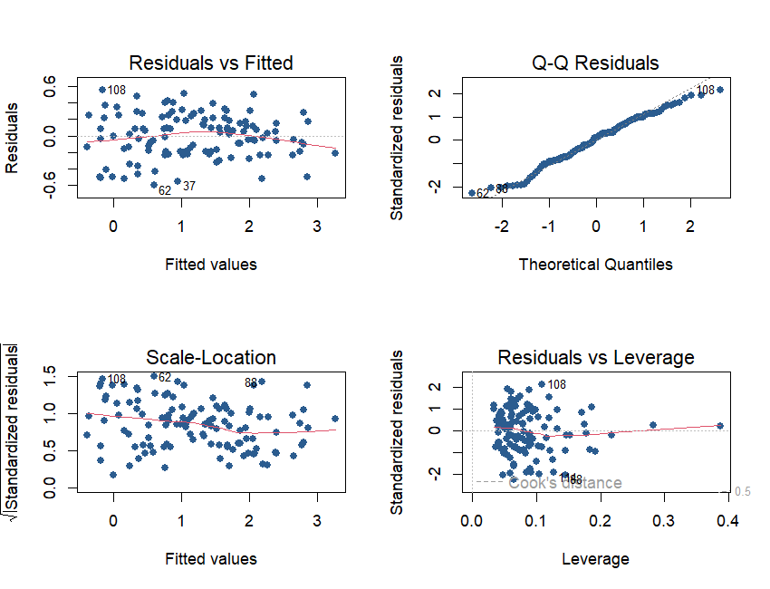
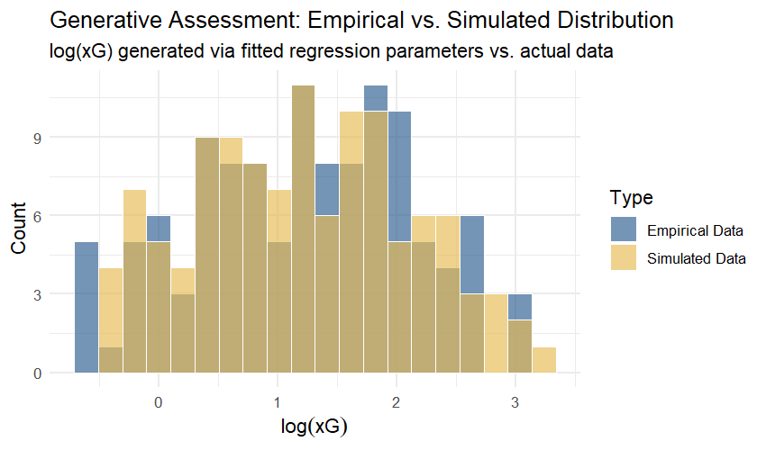

# Evaluating Offensive Production in Serie A
### An Applied Linear Modeling Approach on Expected Goals (xG)

[](https://www.r-project.org/)
[](https://fbref.com/)
[]()
[]()

> **Author**: **Alessandro Castellani**  
> *Undergraduate background in Mathematics (Università dell'Insubria) | Graduate coursework in Applied Statistics & Data Science (Università Cattolica del Sacro Cuore)*  
> 📬 [alecaste041202@gmail.com](mailto:alecaste041202@gmail.com) | 🔗 [LinkedIn Profile](https://www.linkedin.com/in/alessandro-castellani-4905a7246-4905a7246/-4905a7246/) | 🐙 [GitHub Profile](https://github.com/apmcastellani-projects)

---

## 📑 Quick Access

- 📄 **[Download the Full Academic Paper (PDF)](./Final-Assignment.pdf)**
- 💻 **[Reproducible R Markdown Source Code](./Final%20Assignment.Rmd)**
- 📊 **[Opta/FBref Season Dataset (Excel)](./strikers.xlsx)**

---

## ⚽ Project Overview & Research Question

In modern sports analytics, **Expected Goals (xG)** represents the benchmark metric for quantifying chance quality, separating sustainable chance creation from short-term finishing luck.

This project investigates a central question in football analytics:
> *Is expected danger ($	ext{xG}$) purely a function of shot volume, or do structural tactical dimensions—such as shot proximity, territorial dominance in the penalty area, and club competitive tier—play a quantifiable role in explaining offensive output?*

The analysis investigates **120 forwards in the Italian Serie A (2021/2022 season)** with a minimum exposure threshold of **350 minutes played** to filter low-sample noise.

---

## 🔬 Methodology & Modeling Strategy

```
[Raw FBref/Opta Data] 
       │ 
       ▼
[Filtering (≥350 mins) & Log-Transform: log(xG)]
       │
       ▼
[Tactical Categorization: Team Tier (1st/2nd/3rd) & Age Groups]
       │
       ▼
[Variable Selection: Best Subset Selection (AIC, BIC, Mallows' Cp)]
       │
       ▼
[Domain-Informed Outlier Diagnostics (Identifying Tactical Anomalies)]
       │
       ▼
[Partial F-Test on Collinear Metrics (xA, SCA)]
       │
       ▼
[Final Model (R² = 91.4%) & Out-of-Sample Validation (Giroud 22/23)]
```

### 1. Response Variable Transformation
Because $	ext{xG}$ has strictly positive support and positive right-skewness, we apply a logarithmic transformation:
$$\log(	ext{xG})$$
This maps the response onto the real line, stabilizing variance and satisfying classical linear regression assumptions.

### 2. Covariate Selection & Multicollinearity
Analysis of the correlation matrix highlights high collinearity among attacking metrics (e.g., Shot-Creating Actions and Key Passes, $r > 0.85$). 

<p align="center">
  
</p>

Using **Best Subset Selection**, **Forward Selection**, and **Backward Elimination** evaluated across AIC, BIC, Adjusted $R^2$, and Mallows' $C_p$, an optimal **10-parameter specification** was selected incorporating two critical tactical interaction terms:
- **`Sh : Team_Tier`**: Evaluates the quality premium of shots taken in top-tier teams (superior service and pass completion into the final third).
- **`Sh : Tou_Att`**: Evaluates box occupancy vs. isolated long-range shooting.

---

## 🎯 Domain-Informed Outlier Diagnostics

Classical residual analysis initially returned a Shapiro-Wilk normality test p-value of **0.038**, rejecting normality. Rather than mechanically trimming outliers, a football-informed audit of the extreme residuals identified four tactical anomalies:

| Observation | Player | Club | Minutes | Shots | xG | Tactical Rationale |
|---|---|---|---|---|---|---|
| **#102** | **Rade Krunić** | AC Milan | 1,416 | 10 | 0.7 | Tactical pressing midfielder deployed in attacking roles to stabilize defensive transitions; not a genuine forward. |
| **#64** | **João Pedro** | Cagliari | 3,323 | 87 | 12.3 | Sole offensive outlet for a relegated team; extreme usage rate and volume (512 touches in box). |
| **#99** | **Patrick Cutrone** | Empoli | 1,401 | 50 | 3.7 | Unusually low shot quality conversion (speculative / contested attempts). |
| **#94** | **Nicola Sansone** | Bologna | 896 | 24 | 3.5 | Extreme average shooting distance (>20.5 meters). |

Excluding these four specific domain anomalies restored residual normality (**Shapiro-Wilk $p = 0.0557$**) while retaining **96.7% of the original dataset** (116/120 observations).

<p align="center">
  
</p>

---

## 📊 Final Model & Key Findings

### Partial F-Test for Parsimony
Testing the joint hypothesis $H_0: eta_{	ext{xA}} = eta_{	ext{SCA}} = 0$ yielded $F = 1.83$ with **$p = 0.165$**. Failing to reject $H_0$ confirms that once shot count, distance, and box activity are accounted for, `xA` and `SCA` become statistically redundant.

### Goodness of Fit
* **Multiple $R^2$**: **0.9139** (explains 91.4% of total variance in $\log(	ext{xG})$)
* **Adjusted $R^2$**: **0.9083**
* **Residual Standard Error (RSE)**: **0.276**

### Out-of-Sample Validation: Olivier Giroud (2022/2023)
The model was tested out-of-sample on AC Milan forward **Olivier Giroud** in the 2022/23 Serie A season ($71$ shots, $10.4$m average distance, $128$ attacking box touches, $4$ tackles won):
* **Actual Season xG**: **11.8**
* **Model Point Estimate**: **12.5 xG**
* **95% Prediction Interval**: **[7.2, 21.6]**

### Generative Stability Assessment
Simulating $n = 116$ synthetic forward profiles from the fitted parameters demonstrates near-perfect distributional overlap with empirical league data:

<p align="center">
  
</p>

---

## 🛠️ Reproduction Instructions

To reproduce the analysis locally:

1. Clone the repository:
   ```bash
   git clone https://github.com/apmcastellani-projects/serie-a-xg-linear-models.git
   cd serie-a-xg-linear-models
   ```
2. Open R or RStudio and ensure required libraries are installed:
   ```r
   install.packages(c("readxl", "tidyverse", "ggcorrplot", "car", "leaps", "faraway", "rmarkdown"))
   ```
3. Compile the full report to PDF:
   ```r
   rmarkdown::render("Final Assignment.Rmd", output_file = "Final-Assignment.pdf")
   ```

---

## 📬 Contact & Opportunities

I am actively seeking **internship and analytical collaboration opportunities** within professional football clubs, sports tech startups, and federations (UEFA / FIFA).

- **Email**: [alecaste041202@gmail.com](mailto:alecaste041202@gmail.com)
- **Phone**: +39 333 528 8084
- **LinkedIn**: [linkedin.com/in/alessandro-castellani-4905a7246](https://www.linkedin.com/in/alessandro-castellani-4905a7246-4905a7246/-4905a7246/)
- **GitHub**: [github.com/apmcastellani-projects](https://github.com/apmcastellani-projects)
